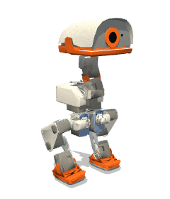
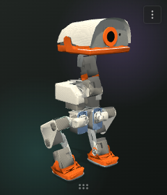
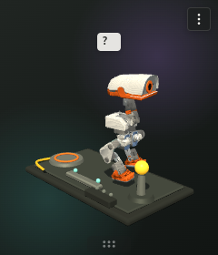
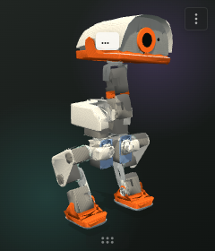

<p align="center">
  
</p>

<h1 align="center">Microduck Habitat</h1>

<p align="center">
  A tiny, curious Microduck that lives on your desktop.
</p>

<p align="center">
  <a href="https://github.com/xujiayuxian-png/microduck-habitat/releases"></a>
  <a href="https://xujiayuxian-png.github.io/microduck-habitat/play/"></a>
  
  
  <a href="LICENSE"></a>
</p>

<p align="center">
  
  
  
</p>

Microduck Habitat is the hardware-free desktop form of the open-source
[Microduck robot](https://github.com/pollen-robotics/microduck). It preserves the robot's baked
mesh, joint hierarchy and voice character without starting or emulating any robot service.

Each seeded duck develops its own temperament and trust. It watches the pointer, responds to touch,
rests, preens, wanders around the desktop and independently explores a small calibration bench.

**[Try Microduck directly in your browser →](https://xujiayuxian-png.github.io/microduck-habitat/play/)**

## Highlights

- **Feels alive:** persistent temperament, energy, curiosity, trust and encounter memory.
- **Lives on the desktop:** a compact transparent window, draggable grip and system tray controls.
- **Explores by itself:** the charge pad, balance rail and signal beacon are selected by internal
  state rather than a fixed animation playlist.
- **Works offline:** no account, telemetry, network service, camera, microphone or screen capture.
- **Native packages:** AppImage and deb for Linux, NSIS for Windows, and DMG/ZIP for macOS.
- **Hardened Electron boundary:** sandboxed renderer, context isolation, narrow IPC and a strict
  Content Security Policy.

## Install and run

Prebuilt packages will be available on the
[GitHub Releases page](https://github.com/xujiayuxian-png/microduck-habitat/releases). The first
release is currently being validated on Ubuntu, Windows and macOS.

To run from source, install Node.js 22 and npm 10 or newer:

```sh
git clone https://github.com/xujiayuxian-png/microduck-habitat.git
cd microduck-habitat
npm ci
npm run dev
```

Move the pointer over Microduck to interact with it. Use the grip below its feet to move the
habitat. The upper-right menu can mute Microduck, request a rest, open the calibration bench,
restore the home position or hide the window. The tray menu can show it again, quit, enable launch
at login and control idle-time responses.

## Platform support

| Platform | Package | Desktop behavior |
| --- | --- | --- |
| Windows 10/11 | NSIS `.exe` | Transparent click-through, tray and desktop walking |
| macOS 12+ | `.dmg`, `.zip` | Intel and Apple silicon builds, menu-bar tray and desktop walking |
| Ubuntu Linux | `.AppImage`, `.deb` | Reliable full-window input and tray; desktop walking on X11 |

On Linux, Electron cannot reliably restore input to an X11 transparent window after mouse
passthrough. Habitat therefore keeps its small `240×280` window interactive; its transparent pixels
remain visually transparent but occupy that input rectangle. Native Wayland compositors control
top-level window placement, so Microduck walks in place there instead of moving the window.

## Build and verify

Run the core checks on every target platform before packaging:

```sh
npm ci
npm run audit:dependencies
npm run typecheck
npm test
npm run smoke
npm run dist
npm run verify:package
npm run verify:launch
```

Linux should additionally run `npm run verify:appimage`. Rendering changes can be reviewed with
`npm run capture:activities`, while `npm run capture:readme` regenerates the images above from the
real application.

See [`RELEASING.md`](RELEASING.md) for the complete Ubuntu, Windows and macOS release checklist,
artifact collection, checksums, SBOM generation and manual GitHub Release procedure.

## How behavior works

`src/mind.ts` owns persistent state and selects high-level activity. `src/animation.ts` translates
that state into joint poses, while `src/workbench.ts` plans exploration. Optional behavior providers
may submit a `BehaviorIntent`, but they cannot bypass energy, personality, forced rest or reactive
states, and they never receive Node.js, filesystem, Electron IPC or raw screen access.

The only persistent user data is a small `habitat.json` in Electron's application-data directory.
It contains the duck seed, quiet setting, trust, encounter count, bench state, discoveries and the
idle-response preference. See [`SECURITY.md`](SECURITY.md) for the complete trust boundary.

## Project

- Contributions: [`CONTRIBUTING.md`](CONTRIBUTING.md)
- Security policy: [`SECURITY.md`](SECURITY.md)
- Asset provenance: [`assets/README.md`](assets/README.md)
- Dependency and asset notices: [`THIRD_PARTY.md`](THIRD_PARTY.md)
- License: [Apache-2.0](LICENSE)

This is a community-developed derivative maintained by
[xujiayu](https://github.com/xujiayuxian-png). It is not an official Pollen Robotics product and
does not imply endorsement by Pollen Robotics.
